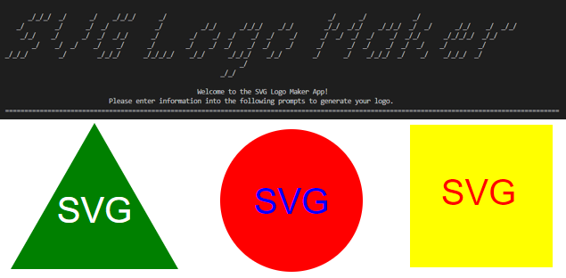

  
  # SVG Logo Maker

  ## Table of Contents
  - [Description](#project-description)
  - [Installation](#installation)
  - [Usage](#usage)
  - [Contribution](#contribution)
  - [Testing](#testing)
  - [Contact](#contact)

  ## Project Description
  This is the Module 10 coding project. We are using node.js and jest to build an SVG logo maker.
  
  ### License 
  MIT
  
  
  
   

  
  ## Installation 
  Clone the repo, then open it via VS code.

  ## Usage 
  Run the program in the terminal using the scripts found in the package.json file.  
  "npm start" will start the app

  ## Contribution
  This project is open to collaboration.

  ## Testing
  Run the program in the terminal using the scripts found in the package.json file.  
  "npm test" will run the jest tests

  
  ## Contact
  Please contact [CML120](https://github.com/CML120) at cheelor922@gmail.com with any questions.

https://github.com/CML120/SVG-Logo-Maker/assets/126404917/c634c5d6-b013-4059-861a-6f2213aaabf5

